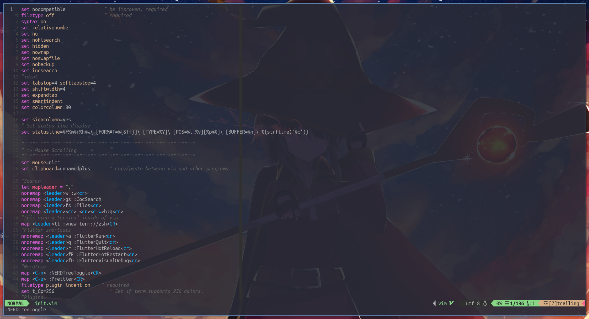

# nvim
my neovim config for python flask, php flutter javascrpit



## installation
### Vim plug
```
sh -c 'curl -fLo "${XDG_DATA_HOME:-$HOME/.local/share}"/nvim/site/autoload/plug.vim --create-dirs \
       https://raw.githubusercontent.com/junegunn/vim-plug/master/plug.vim'
```

### Node

```
- sudo apt-get install nodejs
- sudo pacman -Syu nodejs
- sudo dnf install nodejs
```

### npm
```
- sudo apt-get install npm
- sudo pacman -Syu npm
- sudo dnf install npm
```

### yarn
```
sudo npm install yarn
```

### Setting
#### Dart skd
```
- sudo apt-get install dart
- sudo pacman -Syu dart
```


### Fonts
#### NerdFonts
Download it from https://www.nerdfonts.com/font-downloads

I recomend to use momonoki nerd font

Then execute ```:PlugInstall``` inside neovim and it should be ready.
### extensions 
```
- :CocInstall coc-html
- :CocInstall coc-git
- :CocInstall coc-pyright
- :CocInstall flutter
- :CocInstall coc-css
```
# Using

My keybindings in normal mode

| Key                  | Action                     |
| -------------------- | -------------------------- |
| **,+w**              | Save a file                 |
| **,+fs**             | Search a file               |
| **,+tt**             | Open a terminal            |
| **a**                | Flutter run                |
| **q**                | Flutter quit               |
| **r**                | Flutter Reload             |
| **fR**               | Flutter Restart            |  
| **Ctrl+n**           | Nerd Tree                  |
| **Ctrl+a**           | Format code                |
| **gd**               | Go definition               |
| **gy**               | Type definition             |
| **gi**               | Go implementation          |
| **gr**               | Go references              |

